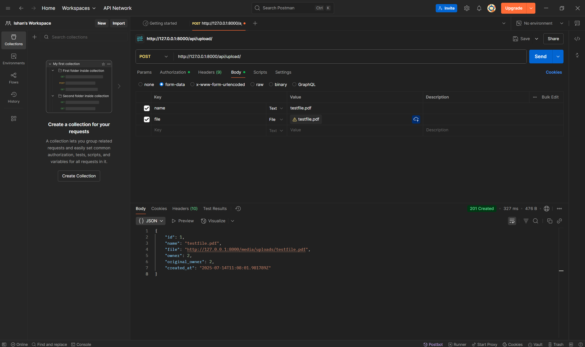
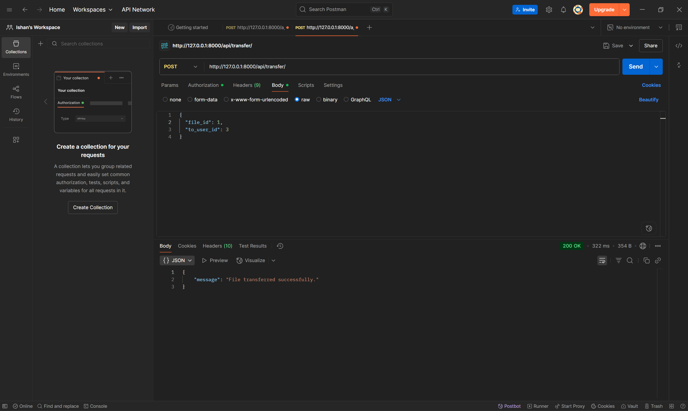
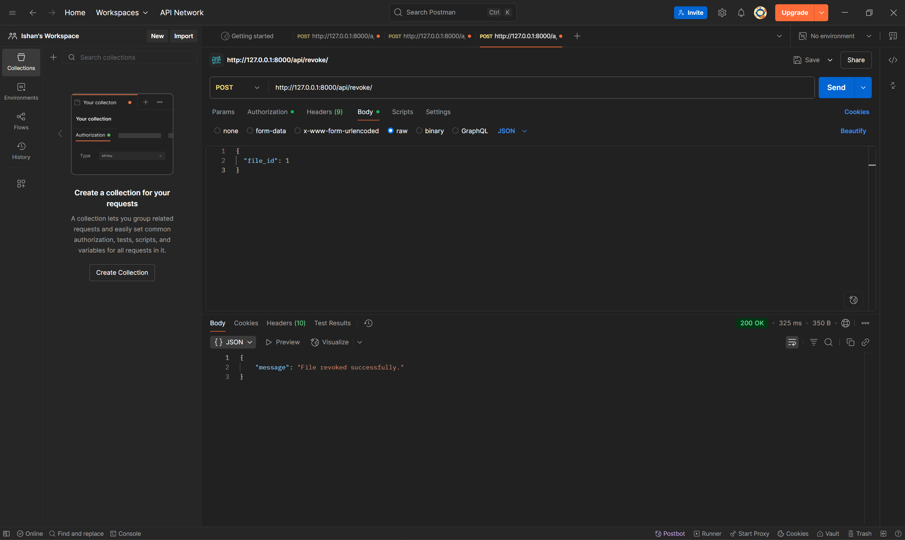
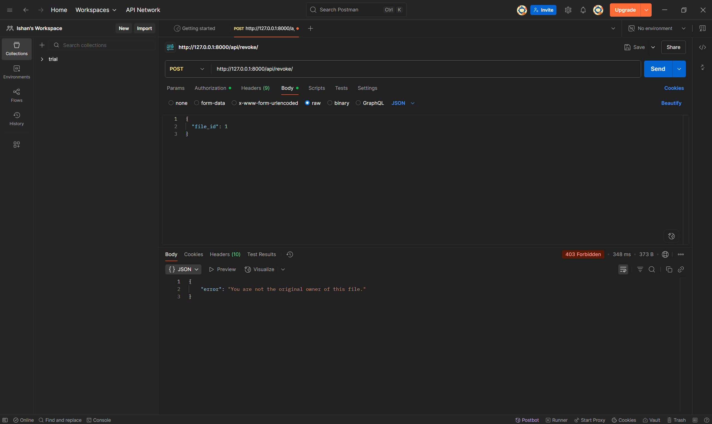
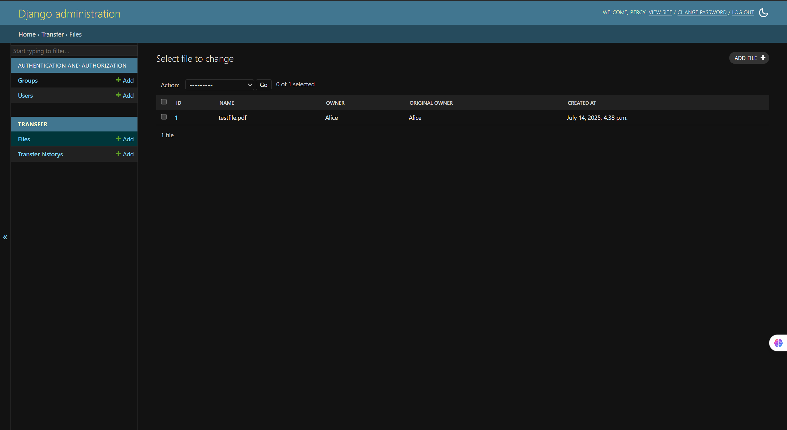
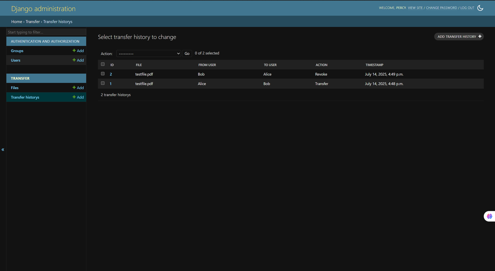

# 📁 Django File Ownership Transfer API

This Django REST API allows authenticated users to upload files, transfer file ownership to other users, and revoke those transfers. Every action is tracked with a full transfer history log.

---

## 🚀 Features

- 🔐 User authentication (Basic Auth)
- 📤 File upload with automatic ownership assigned
- 🔁 Transfer file ownership to another user
- 🔙 Revoke file transfer to reclaim ownership
- 🕓 Full transfer and revoke history with timestamps
- 🧾 Django admin panel for managing users, files, and history

---

## 🏗️ Tech Stack

- Python 3.x
- Django 4.x
- Django REST Framework
- SQLite3 (default database)

---

## 📦 Setup Instructions

### 1. Clone or Download the Project and go to the base directory

### 2. Create and Activate a Virtual Environment

```bash
python -m venv env
source env/bin/activate  # On Windows: env\Scripts\activate
````

---

### 3. Install Django and Django REST Framework

```bash
pip install django djangorestframework
```

---

### 4. Run Migrations and Create a Superuser

```bash
python manage.py makemigrations
python manage.py migrate
python manage.py createsuperuser
```

---

### 5. Start the Server

```bash
python manage.py runserver
```

---

## 🔑 API Endpoints

| Method | Endpoint         | Description                   | Auth Required |
| ------ | ---------------- | ----------------------------- | ------------- |
| POST   | `/api/upload/`   | Upload a file                 | ✅ Yes         |
| POST   | `/api/transfer/` | Transfer file to another user | ✅ Yes         |
| POST   | `/api/revoke/`   | Revoke a file transfer        | ✅ Yes         |

---

## 📋 Request Format

### 🔸 Transfer File Example

```json
{
  "file_id": 1,
  "to_user_id": 2
}
```

### 🔸 Revoke File Example

```json
{
  "file_id": 1
}
```

> 🛡️ All requests require Basic Auth using a valid username and password.

---

## 🧪 Testing with Postman

Used [Postman](https://www.postman.com/) to test all API endpoints.

---

## 📸 Screenshots & Demonstration

The following screenshots illustrate a complete usage flow of the File Ownership Transfer API (using a single file, testfile.pdf, and 2 users, Alice and Bob):

---

### 1. File Uploaded by Alice

Alice uploads a file using the `/api/upload/` endpoint.


> The file (with id 1) is now owned by Alice (whose user id is 2) and she is set as the original owner of the file and the file appears in the admin panel under the `File` model.

---

### 2. File Transferred to Bob

Alice transfers the file to Bob using the `/api/transfer/` endpoint.


> The file ownership has been successfully changed to Bob (whose user id is 3), and a transfer entry is logged.

---

### 3. File Revoked by Alice

Alice revokes the file transfer, reclaiming ownership from Bob using `/api/revoke/`.


> Ownership is reverted to Alice (since she was the original owner of the file), and another entry is added in the transfer history.

---

### 4. Bob Tries to Revoke File Owned by Alice

Bob tries to revoke file owned by Alice using `/api/revoke/` but since Alice is the original owner of the file, he is unable to do so.


> Error displayed since Bob is not the original owner of the file.

---

### 5. Admin Panel - File Model

Admin view showing the file record with updated `owner` and `original_owner`.


> This reflects the current state of ownership after the revoke.

---

### 6. Admin Panel - Transfer History Model

Shows the full history of actions: transfer to Bob and revoke by Alice.


> Both actions are timestamped and indicate the `from_user`, `to_user`, and action type.

---
The first 4 images are screenshots of Postman while testing the API and the last 2 images are screenshots of the database state (in the `admin` panel of Django) after the Postman testing.